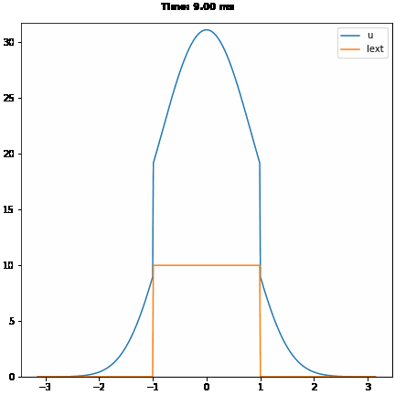
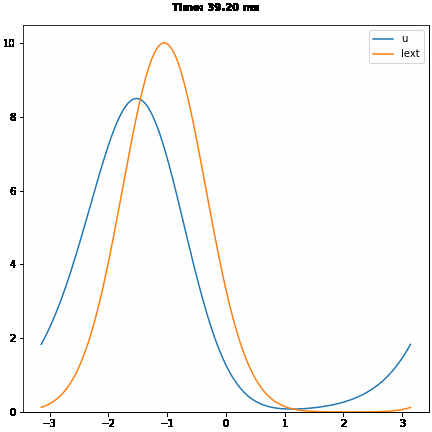

#  <center> CANN Implementation with BrainPy </center>
   <center>王宇哲 1800011828</center>
   <center>College of Chemistry and Molecular Engineering, Peking University</center>

本次作业通过BrainPy实现连续吸引子神经网络（Continuous Attractor Neural Networks, CANN）模型，并对CANN模型的性质进行简要讨论。

首先import必要的python module：


```python
import brainpy as bp
import brainpy.math as bm
import matplotlib.pyplot as plt
%matplotlib inline
```

CANN的数学模型由下列方程给出：

$$
\tau \frac{du(x,t)}{dt} = -u(x,t) + \rho \int dx' J(x,x') r(x',t)+I_{ext}
$$

$$
r(x,t) = \frac{u(x,t)^2}{1 + k \rho \int dx' u(x',t)^2}
$$


$$
J(x,x') = \frac{1}{\sqrt{2\pi}a}\exp(-\frac{|x-x'|^2}{2a^2})
$$

$$
I_{ext} = A\exp\left[-\frac{|x-z(t)|^2}{4a^2}\right]
$$
其中参数$\tau$为神经细胞突触的时间常数，$k$表征神经细胞受抑制的程度，$a$为兴奋性连接（excitatory connection）的半峰宽，$A$为外界刺激的强度，$J_{0}$为神经细胞的最大连接值（maximum connection value）。

根据以上数学模型，使用BrainPy的ODE numerical solver模块odeint实现常微分方程的数值求解，通过对BrainPy中NeuGroup类继承的方式，对CANN模型进行代码实现如下：


```python
class CANN1D(bp.NeuGroup):
    @bp.odeint
    def int_u(self, u, t, Iext):
        r1 = bp.math.square(u)
        r2 = 1.0 + self.k * bp.math.sum(r1)
        r = r1 / r2
        Irec = bp.math.dot(self.conn_mat, r)
        du = (-u + Irec + Iext) / self.tau
        return du
    
    def __init__(self, num, tau=1., k=8.1, a=0.5, A=10., J0=4.,
               z_min=-bp.math.pi, z_max=bp.math.pi, **kwargs):
        super(CANN1D, self).__init__(size=num, **kwargs)
        # parameters
        self.tau = tau  # The synaptic time constant
        self.k = k  # Degree of the rescaled inhibition
        self.a = a  # Half-width of the range of excitatory connections
        self.A = A  # Magnitude of the external input
        self.J0 = J0  # maximum connection value

        # feature space
        self.z_min = z_min
        self.z_max = z_max
        self.z_range = z_max - z_min
        self.x = bp.math.linspace(z_min, z_max, num)  # The encoded feature values
        self.rho = num / self.z_range  # The neural density
        self.dx = self.z_range / num  # The stimulus density

        # variables
        self.u = bp.math.Variable(bp.math.zeros(num))
        self.input = bp.math.Variable(bp.math.zeros(num))

        # The connection matrix
        self.conn_mat = self.make_conn(self.x)
        
    def dist(self, d):
        d = bp.math.remainder(d, self.z_range)
        d = bp.math.where(d > 0.5 * self.z_range, d - self.z_range, d)
        return d
    
    def make_conn(self, x):
        assert bp.math.ndim(x) == 1
        x_left = bp.math.reshape(x, (-1, 1))
        x_right = bp.math.repeat(x.reshape((1, -1)), len(x), axis=0)
        d = self.dist(x_left - x_right)
        Jxx = self.J0 * bp.math.exp(-0.5 * bp.math.square(d / self.a)) / \
              (bp.math.sqrt(2 * bp.math.pi) * self.a)
        return Jxx
    
    def get_stimulus_by_pos(self, pos):
        return self.A * bp.math.exp(-0.25 * bp.math.square(self.dist(self.x - pos) / 0.5))
    
    # Non-gaussian stimulus (square wave)
    def get_stimulus_by_pos_non_gaussian(self, pos):
        return self.A  * bp.math.select([self.x>=1,self.x>=-1, self.x<-1], [0.0, 1.0, 0.0])
    
    def update(self, _t, _dt):
        self.u[:] = self.int_u(self.u, _t, self.input)
        self.input[:] = 0.
```


## 1. Population Coding

对Population Coding进行代码实现如下，其中外界刺激为中心在$x=0$的${\rm Gauss}$波包，持续$8.0\ \ {\rm s}$：


```python
cann = CANN1D(num=512, k=0.1, monitors=['u'])

I1 = cann.get_stimulus_by_pos(0.)
Iext, duration = bp.inputs.section_input(values=[0., I1, 0.],
                                         durations=[1., 8., 8.],
                                         return_length=True)
cann.run(duration=duration, inputs=('input', Iext, 'iter'), report=0.1)
```

代码运行输出：

    Compilation used 0.0095 s.
    Start running ...
    Run 10.0% used 0.003 s.
    Run 20.0% used 0.007 s.
    Run 30.0% used 0.017 s.
    Run 40.0% used 0.027 s.
    Run 50.0% used 0.032 s.
    Run 60.0% used 0.036 s.
    Run 70.0% used 0.042 s.
    Run 80.0% used 0.048 s.
    Run 90.0% used 0.053 s.
    Run 100.0% used 0.058 s.
    Simulation is done in 0.059 s.


    0.059377431869506836

绘制CANN模型encoding过程的gif图：


```python
%%capture
fig_1 = bp.visualize.animate_1D(
  dynamical_vars=[{'ys': cann.mon.u, 'xs': cann.x, 'legend': 'u'},
                  {'ys': Iext, 'xs': cann.x, 'legend': 'Iext'}],
  frame_step=1,
  frame_delay=100,
  show=False,
  save_path='cann-encoding.gif'
)
```

限于pdf格式，选取$t=9.00\ \ {\rm ms}$的一帧，如下图所示：


可见CANN模型很好地反映了神经系统对外界刺激encoding的过程。而当外界刺激消失后，神经系统活动$u$先逐渐回落，随后保持稳定不变，如下图所示（$t=16.00\ \ {\rm ms}$）：


下面对CANN模型的encoding过程作一简要讨论。


### Discussion 1:  Non-gaussian Stimulus

假设外界刺激并非${\rm Gauss}$波包的形式，CANN是否仍然能对该刺激作出响应？考虑以非高斯形状的方波（square wave）作为外界刺激输入，峰值和持续时间与前述${\rm Gauss}$波包保持一致，代码实现如下：


```python
cann = CANN1D(num=512, k=0.1, monitors=['u'])

I1 = cann.get_stimulus_by_pos_non_gaussian(0.)
Iext, duration = bp.inputs.section_input(values=[0., I1, 0.],
                                         durations=[1., 8., 8.],
                                         return_length=True)
cann.run(duration=duration, inputs=('input', Iext, 'iter'), report=0.1)
```

代码运行输出：

    Compilation used 0.0010 s.
    Start running ...
    Run 10.0% used 0.006 s.
    Run 20.0% used 0.012 s.
    Run 30.0% used 0.018 s.
    Run 40.0% used 0.023 s.
    Run 50.0% used 0.028 s.
    Run 60.0% used 0.032 s.
    Run 70.0% used 0.038 s.
    Run 80.0% used 0.044 s.
    Run 90.0% used 0.052 s.
    Run 100.0% used 0.058 s.
    Simulation is done in 0.058 s.


    0.057852745056152344

绘制该过程的gif图：


```python
%%capture
fig_1_1 = bp.visualize.animate_1D(
  dynamical_vars=[{'ys': cann.mon.u, 'xs': cann.x, 'legend': 'u'},
                  {'ys': Iext, 'xs': cann.x, 'legend': 'Iext'}],
  frame_step=1,
  frame_delay=100,
  show=False,
  save_path='cann-encoding-non-gaussian.gif'
)
```

仍然选取$t=9.00\ \ {\rm ms}$的一帧，如下图所示：



可见神经系统的响应受到了外界刺激输入的形式的影响，不再是${\rm Gauss}$波包形状的响应。而当外界刺激消失后，神经系统的活动$u$先逐渐回落，随后保持稳定，仍然具有${\rm Gauss}$波包的形状，如下图所示（$t=16.00\ \ {\rm ms}$）：


对比可以发现，当强度（峰值）相同的${\rm Gauss}$波包和方波作为外界刺激输入时，神经系统的响应有所不同，但该刺激消失后，神经系统保持强度相近、形状相同（${\rm Gauss}$波包）的活动。这是符合逻辑的，因为CANN通过固定的template“记住”外界输入的刺激。


### Discussion 2:  Parameters in CANN

下面对CANN模型中的参数$\tau$、$k$、$a$、$J_{0}$的影响作一简要讨论。

对于参数$\tau$，设定$\tau=10.0$（模型默认值$\tau_{0}=1.0$），代码实现并绘制gif图如下：


```python
%%capture
cann = CANN1D(num=512, k=0.1, tau=10.0, monitors=['u'])

I1 = cann.get_stimulus_by_pos(0.)
Iext, duration = bp.inputs.section_input(values=[0., I1, 0.],
                                         durations=[1., 8., 8.],
                                         return_length=True)
cann.run(duration=duration, inputs=('input', Iext, 'iter'), report=0.1)

fig_1_2 = bp.visualize.animate_1D(
  dynamical_vars=[{'ys': cann.mon.u, 'xs': cann.x, 'legend': 'u'},
                  {'ys': Iext, 'xs': cann.x, 'legend': 'Iext'}],
  frame_step=1,
  frame_delay=100,
  show=False,
  save_path='cann-encoding-para-tau.gif'
)
```

仍然选取$t=9.00\ \ {\rm ms}$的一帧，如下图所示：


可见由于$\tau$值过大，神经系统的响应较为缓慢，在$9.00\ \ {\rm ms}$内$u$尚未达到峰值，外界刺激就已经消失。随后神经系统的活动$u$经历缓慢上升-缓慢下降的过程，但在gif图所示的$17.00\ \ {\rm ms}$内始终未能达到稳定。

对于参数 $k$，选取$k=10.0$（模型默认值$k_{0}=1.0$），代码实现并绘制gif图如下：


```python
%%capture
cann = CANN1D(num=512, k=10.0, monitors=['u'])

I1 = cann.get_stimulus_by_pos(0.)
Iext, duration = bp.inputs.section_input(values=[0., I1, 0.],
                                         durations=[1., 8., 8.],
                                         return_length=True)
cann.run(duration=duration, inputs=('input', Iext, 'iter'), report=0.1)

fig_1_3 = bp.visualize.animate_1D(
  dynamical_vars=[{'ys': cann.mon.u, 'xs': cann.x, 'legend': 'u'},
                  {'ys': Iext, 'xs': cann.x, 'legend': 'Iext'}],
  frame_step=1,
  frame_delay=100,
  show=False,
  save_path='cann-encoding-para-k.gif'
)
```

仍然选取$t=9.00\ \ {\rm ms}$的一帧，如下图所示：


可见由于$k$值过大，神经系统活动的抑制作用较强，在外界刺激下达到的稳定峰值低于$k=1.0$时。而当外界刺激消失后，神经系统的活动迅速衰减，在$t=16.00\ \ {\rm ms}$时，神经系统活动$u\approx 0$，如下图所示：


对于参数 $a$，选取$a=1.0$（模型默认值$a_{0}=0.5$），代码实现并绘制gif图如下：


```python
%%capture
cann = CANN1D(num=512, k=0.1, a=1.0, monitors=['u'])

I1 = cann.get_stimulus_by_pos(0.)
Iext, duration = bp.inputs.section_input(values=[0., I1, 0.],
                                         durations=[1., 8., 8.],
                                         return_length=True)
cann.run(duration=duration, inputs=('input', Iext, 'iter'), report=0.1)

fig_1_4 = bp.visualize.animate_1D(
  dynamical_vars=[{'ys': cann.mon.u, 'xs': cann.x, 'legend': 'u'},
                  {'ys': Iext, 'xs': cann.x, 'legend': 'Iext'}],
  frame_step=1,
  frame_delay=100,
  show=False,
  save_path='cann-encoding-para-a.gif'
)
```

仍然选取$t=9.00\ \ {\rm ms}$的一帧，如下图所示：


可见在外界输入刺激相同的情况下，$a$值仅影响神经系统活动的半峰宽。

对于参数 $J_{0}$，选取$J_{0}=1.0$（模型默认值$J_{0}=0.5$），代码实现并绘制gif图如下： 


```python
%%capture
cann = CANN1D(num=512, k=0.1, J0=1.0, monitors=['u'])

I1 = cann.get_stimulus_by_pos(0.)
Iext, duration = bp.inputs.section_input(values=[0., I1, 0.],
                                         durations=[1., 8., 8.],
                                         return_length=True)
cann.run(duration=duration, inputs=('input', Iext, 'iter'), report=0.1)

fig_1_5 = bp.visualize.animate_1D(
  dynamical_vars=[{'ys': cann.mon.u, 'xs': cann.x, 'legend': 'u'},
                  {'ys': Iext, 'xs': cann.x, 'legend': 'Iext'}],
  frame_step=1,
  frame_delay=100,
  show=False,
  save_path='cann-encoding-para-J0.gif'
)
```

仍然选取$t=9.00\ \ {\rm ms}$的一帧，如下图所示：


可见$J_{0}$值影响神经系统活动的强度，$J_{0}$较大时活动强度较低。外界刺激消失后，$t=16.00\ \ {\rm ms}$时，神经系统活动稳定在较低的强度，如下图所示：


## 2. Template Matching

对Template Matching进行代码实现如下，其中$0\sim 10\ \ {\rm ms}$内外界刺激为中心在$x=0.5$的${\rm Gauss}$波包，$10\sim 40\ \ {\rm ms}$内外界刺激为中心在$x=0$的${\rm Gauss}$波包加上随机的${\rm Gauss}$噪声：


```python
cann = CANN1D(num=512, k=8.1, monitors=['u'])

dur1, dur2, dur3 = 10., 30., 0.
num1 = int(dur1 / bp.math.get_dt())
num2 = int(dur2 / bp.math.get_dt())
num3 = int(dur3 / bp.math.get_dt())
Iext = bp.math.zeros((num1 + num2 + num3,) + cann.size)
Iext[:num1] = cann.get_stimulus_by_pos(0.5)
Iext[num1:num1 + num2] = cann.get_stimulus_by_pos(0.)
Iext[num1:num1 + num2] += 0.1 * cann.A * bp.math.random.randn(num2, *cann.size)
cann.run(duration=dur1 + dur2 + dur3, inputs=('input', Iext, 'iter'), report=0.1)
```

代码运行输出：

    Compilation used 0.0007 s.
    Start running ...
    Run 10.0% used 0.021 s.
    Run 20.0% used 0.044 s.
    Run 30.0% used 0.071 s.
    Run 40.0% used 0.106 s.
    Run 50.0% used 0.141 s.
    Run 60.0% used 0.175 s.
    Run 70.0% used 0.204 s.
    Run 80.0% used 0.236 s.
    Run 90.0% used 0.323 s.
    Run 100.0% used 0.350 s.
    Simulation is done in 0.351 s.


    0.35123682022094727

绘制该过程的gif图：


```python
%%capture
fig_2 = bp.visualize.animate_1D(
  dynamical_vars=[{'ys': cann.mon.u, 'xs': cann.x, 'legend': 'u'},
                  {'ys': Iext, 'xs': cann.x, 'legend': 'Iext'}],
  frame_step=5,
  frame_delay=50,
  show=False,
  save_path='cann-decoding.gif'
)
```

选取$t=9.70\ \ {\rm ms}$的一帧，如下图所示：


此时CANN模型使得神经系统的活动对${\rm Gauss}$波包形状的外界刺激实现了很好的matching。而当外界刺激的位置发生移动（中心位置$x=0.5\rightarrow x=0$），神经系统活动也很好地track了外界刺激的移动，如下图所示（从左到右 $t=10.20\ \ {\rm ms}$、$t=10.70\ \ {\rm ms}$、$t=11.20\ \ {\rm ms}$）：


而对于带有随机噪声的外界刺激，CANN模型的decoding过程也能够通过template matching很好地实现对输入信号的平滑，如下图所示（$t=39.70\ \ {\rm ms}$）：


## 3. Smooth Tracking

对Smooth Tracking进行代码实现如下，其中$0\sim 20\ \ {\rm ms}$、$40\sim 60\ \ {\rm ms}$外界刺激（${\rm Gauss}$波包）静止，$20\sim 40\ \ {\rm ms}$外界刺激正向匀速移动：


```python
cann = CANN1D(num=512, k=8.1, monitors=['u'])

dur1, dur2, dur3 = 20., 20., 20.
num1 = int(dur1 / bp.math.get_dt())
num2 = int(dur2 / bp.math.get_dt())
num3 = int(dur3 / bp.math.get_dt())
position = bp.math.zeros(num1 + num2 + num3)
position[num1: num1 + num2] = bp.math.linspace(0., 12., num2)
position[num1 + num2:] = 12.
position = position.reshape((-1, 1))
Iext = cann.get_stimulus_by_pos(position)
cann.run(duration=dur1 + dur2 + dur3, inputs=('input', Iext, 'iter'), report=0.1)
```

代码运行输出：

    Compilation used 0.0000 s.
    Start running ...
    Run 10.0% used 0.118 s.
    Run 20.0% used 0.185 s.
    Run 30.0% used 0.230 s.
    Run 40.0% used 0.302 s.
    Run 50.0% used 0.369 s.
    Run 60.0% used 0.396 s.
    Run 70.0% used 0.447 s.
    Run 80.0% used 0.498 s.
    Run 90.0% used 0.550 s.
    Run 100.0% used 0.574 s.
    Simulation is done in 0.574 s.


    0.5744638442993164

绘制该过程的gif图：


```python
%%capture
fig_3 = bp.visualize.animate_1D(
  dynamical_vars=[{'ys': cann.mon.u, 'xs': cann.x, 'legend': 'u'},
                  {'ys': Iext, 'xs': cann.x, 'legend': 'Iext'}],
  frame_step=5,
  frame_delay=50,
  show=False,
  save_path='cann-tracking.gif'
)
```

选取$t=39.20\ \ {\rm ms}$的一帧，如下图所示：



可见CANN模型能够很好地track外界刺激的移动，相位略微滞后于外界刺激。
