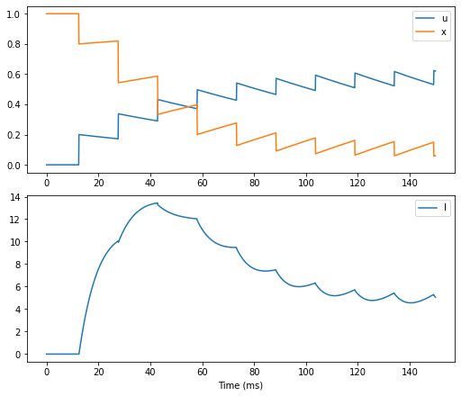

#  <center>STP Implementation with BrainPy</center>
   <center>王宇哲 1800011828</center>
   <center>College of Chemistry and Molecular Engineering, Peking University</center>

本次作业通过BrainPy实现突触的短期可塑性（Short-term Plasticity, STP）模型，并对STP模型中各参数的意义及模型的性质进行简要讨论。

首先import必要的python module。


```python
import brainpy as bp
import brainpy.math as bm
import brainmodels
import matplotlib.pyplot as plt
%matplotlib inline
```

STP的数学模型由下列方程给出：
$$
\frac{du}{dt}  =  -\frac{u}{\tau_f}+U(1-u^-)\delta(t-t_{sp})
$$

$$
\frac{dx}{dt}  =  \frac{1-x}{\tau_d}-u^+x^-\delta(t-t_{sp})
$$

$$
\frac{dI}{dt}  =  -\frac{I}{\tau_s} + Au^+x^-\delta(t-t_{sp})
$$

其中模型变量$u$为神经递质的释放概率，初始值为$0$，$x$表征剩余神经递质的比例，初始值为$1$，$I$为输出到突触后神经元的突触电流，初始值为$0$，$t_{sp}$为脉冲发放的时刻。模型参数$U$表征单个脉冲导致$u$的增量，$\tau_{d}$为短期抑制（short-term depression, STD）的时间常数，$\tau_{f}$为短期促进（short-term facilictation, STF）的时间常数。

在$t_{sp}$时，脉冲发放所产生的突触电流由
$$
\Delta I(t_{sp}) = Au^+x^-
$$

给出，其中$A$表征对神经递质释放的响应幅度。

根据以上数学模型，使用brainmodels库对神经元和突触进行建模，使用BrainPy的Network module构建网络，使用StructRunner模块实现运行模拟，使用python matplotlib库进行作图，基本代码实现如下：


```python
def STP_run_and_plot(U, tau_d, tau_f, name):
    neu1 = brainmodels.neurons.LIF(1)
    neu2 = brainmodels.neurons.LIF(1)
    syn1 = brainmodels.synapses.STP(neu1, neu2, bp.connect.All2All(), U=U, tau_d=tau_d, tau_f=tau_f)
    net = bp.Network(pre=neu1, syn=syn1, post=neu2)
    
    # run
    runner = bp.StructRunner(net, inputs=[('pre.input', 28.)], monitors=['syn.I', 'syn.u', 'syn.x'])
    runner.run(150.)
    
    # plot
    fig, gs = bp.visualize.get_figure(2, 1, 3, 7)

    fig.add_subplot(gs[0, 0])
    plt.plot(runner.mon.ts, runner.mon['syn.u'][:, 0], label='u')
    plt.plot(runner.mon.ts, runner.mon['syn.x'][:, 0], label='x')
    plt.legend()

    fig.add_subplot(gs[1, 0])
    plt.plot(runner.mon.ts, runner.mon['syn.I'][:, 0], label='I')
    plt.legend()

    plt.xlabel('Time (ms)')
    plt.savefig(name, dpi=1000, bbox_inches='tight')
    plt.show()
    
```

## 1. STD

对STD进行代码实现如下。对于STD-dominant情况，神经元脉冲发放导致神经递质不断减少，从而抑制后续突触电流的产生。


```python
STP_run_and_plot(U=0.2, tau_d=150., tau_f=2., name='STD.jpg')
```

<div align=center>


## 2. STF

对STF进行代码实现如下。对于STF-dominant情况，神经元脉冲发放导致$\rm Ca^{2+}$浓度升高，增大了神经递质的释放概率，从而使突触电流不断增大并最终维持在较高值。


```python
STP_run_and_plot(U=0.1, tau_d=10, tau_f=100., name='STF.jpg')
```

<div align=center>


## 3. Discussion

下面对模型参数$U$、$\tau_{d}$、$\tau_{f}$的意义作一简要讨论。

### $U$

在第1部分STD代码实现的基础上，取$U=0.05$，结果如下。


```python
STP_run_and_plot(U=0.05, tau_d=150., tau_f=2., name='U1.jpg')
```

<div align=center>

​    取$U=0.8$，结果如下。

```python
STP_run_and_plot(U=0.8, tau_d=150., tau_f=2., name='U2.jpg')
```

<div align=center>

​    可见$U$的大小对突触电流有显著影响，较大的$U$更显著地抑制突触电脉冲的持续发放，而$U$较小时，能够在较长时间内持续产生规律的突触电脉冲。

### $\tau_d$

在第1部分STD代码实现的基础上，取$\tau_{d}=1.0$，结果如下。


```python
STP_run_and_plot(U=0.2, tau_d=1., tau_f=2., name='tau_d1.jpg')
```

<div align=center>

​    取$\tau_{d}=600$，结果如下。

```python
STP_run_and_plot(U=0.2, tau_d=600., tau_f=2., name='tau_d2.jpg')
```

<div align=center>

  $\tau_{d}$的意义是神经递质比例$x$回复到$1$所对应的时间常数，当$\tau_{d}$较小时，$x$在每次神经递质释放后迅速恢复为$1$，而当$\tau_{d}$较大时，$x$在每次神经递质释放后恢复缓慢。由实验结果可知，较大的$\tau_{d}$能够对后续突触电流产生更显著的抑制效应。  

### $\tau_f$

在第1部分STD代码实现的基础上，取$\tau_{f}=0.5$，结果如下。


```python
STP_run_and_plot(U=0.2, tau_d=150., tau_f=0.5, name='tau_f1.jpg')
```

<div align=center>

  取$\tau_{f}=100$，结果如下。

```python
STP_run_and_plot(U=0.2, tau_d=150., tau_f=100., name='tau_f2.jpg')
```


<div align=center>
$\tau_{f}$的意义是神经递质释放概率$u$回复到$0$所对应的时间常数，当$\tau_{f}$较小时，$u$在每次神经递质释放后迅速恢复为$0$，而当$\tau_{f}$较大时，$u$在每次神经递质释放后恢复缓慢，从而产生积累效应。

根据以上讨论可知，STF的产生对$U$、$\tau_{d}$、$\tau_{f}$有着一定要求，需要$\tau_{f}$较大而$\tau_{d}$较小，从而使得$\Delta I(t_{sp}) = Au^+x^-$维持在较高水平。

